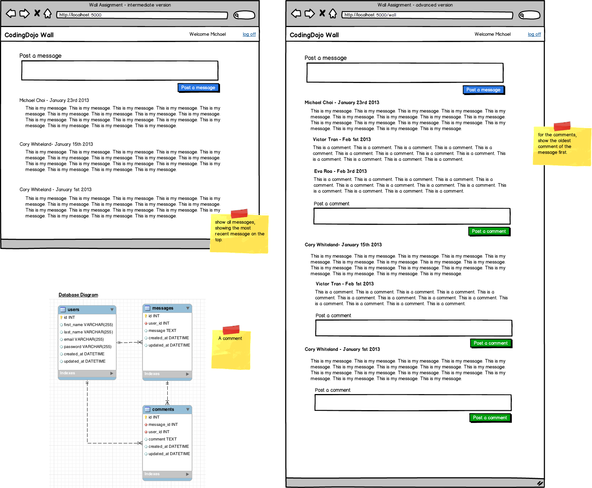

# Python_The_Wall
A news feed site where users will be able to post messages and see the messages posted by other users.

Functionalities:
- [x] Create a new Django project and create a login app and create a new wall app
- [x] Set up the necessary models
- [x] Allow users to post messages
- [x] Display all messages on the main page
- [x] Allow users to comment on each message
- [x] Display all comments per message
- [x] Allow users to delete only their own messages

